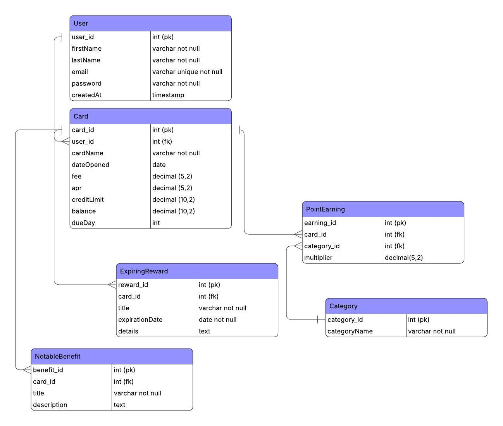

## Project Description

Miles & Smiles Travel Rewards Tracker is a web application designed to help travel enthusiasts make the most of their credit card rewards and benefits. Many travelers juggle multiple reward cards, making it difficult to track points, expiration dates, and annual perks. This app solves that problem by centralizing all card data in one convenient dashboard. Users can easily view their reward points by category, track time-sensitive benefits before they expire, and manage details like APR, utilization, due dates, and fees - all in one place. By maximizing rewards and minimizing missed opportunities, the app helps users travel for free, not for fees.

---
## Technologies Used

**Frontend:**
- React (Vite) - for building a fast, modular, component-based interface  
- React Router DOM - for managing navigation between app views  
- JavaScript - core logic and dynamic rendering  
- HTML5 & CSS3 - structure and styling for modern browser compatibility  
- Flexbox and Media Queries - responsive layouts for desktop and mobile
- Google Fonts & Icons - custom typography and visual design consistency

---

<div>
  
  
  
  
  
  
  
</div>

---

**Backend:**
**Backend:**
- Java (Spring Boot 3) - RESTful API backend framework  
- Spring Web & Data JPA - routing and database integration  
- Spring Security - password encryption and secure user credential storage  
- Hibernate - ORM layer to map entity models to MySQL  
- MySQL Database - persistent data storage  
- Maven - dependency and build management


---

<div>
  
  
  
  
  
  
</div>

---

**Tools & Other Technologies:**
- Postman - tested API endpoints and verified CRUD operations  
- Git & GitHub - version control and future collaboration  
- IntelliJ IDEA & VS Code - IDEs for backend and frontend development  
- Node.js & npm - dependency management and local dev server

---

<div>
  
  
  
  
  
  
</div>

---
## Installation & Local Setup

### Prerequisites
Before running this project locally, ensure you have the following installed:
- **Java 21** (or newer)
- **Node.js** (v18+ recommended)
- **MySQL Server**
- **Maven**
- **VS Code** or **IntelliJ IDEA** for development

### 1. Clone the Repository
```bash
git clone https://github.com/yourusername/miles-and-smiles.git
cd miles-and-smiles
```

### 2. Set Up the MySQL Database

- Open MySQL Workbench (or your preferred client).
- Create a new database:
```SQL
CREATE DATABASE miles_and_smiles;
```

- In the project root, create a .env file and add your database credentials:

```
SPRING_DATASOURCE_URL=jdbc:mysql://localhost:3306/miles_and_smiles
SPRING_DATASOURCE_USERNAME=your_mysql_username
SPRING_DATASOURCE_PASSWORD=your_mysql_password
```

- Note: Hibernate auto-generates all tables from the entity models.You do not need to run any .sql scripts manually.

### 3. Run the Backend (Spring Boot)

- From the root of the backend folder, you can either:

    - **Run the application in IntelliJ**
        - open the main file  
        `MilesAndSmilesApplication.java` and click **▶ Run**,  
    
    - **OR** Run it from the terminal:
        ```bash
        mvn spring-boot:run
        ```
- The backend will start on http://localhost:8080

### 4. . Run the Frontend (React)

- From the terminal of **VS Code**, in your main frontend folder run:

    ```
    npm install
    npm run dev
    ```

- The frontend will start on http://localhost:5173

### 5. Verify Backend & Frontend Connection

- Once both are running:

    - Visit http://localhost:5173

    - Register or log in

    - Add a card and verify your data saves correctly in MySQL

    - You can also test your API endpoints in Postman (e.g., GET http://localhost:8080/cards)

### 6. Default Category Seeding (Automatic)

- When the backend starts for the first time, it automatically seeds 11 default categories:

    - Gas, Restaurant, Supermarket, Discount, Wholesale, Online Shopping, Utilities, Internet, Phone, Travel, and Other.

- You can verify by sending a GET request:

    - GET http://localhost:8080/categories


- Expected response:

    ```
    [
    { "categoryId": 1, "categoryName": "Gas" },
    { "categoryId": 2, "categoryName": "Restaurant" },
    { "categoryId": 3, "categoryName": "Supermarket" },
    { "categoryId": 4, "categoryName": "Discount" },
    { "categoryId": 5, "categoryName": "Wholesale" },
    { "categoryId": 6, "categoryName": "Online Shopping" },
    { "categoryId": 7, "categoryName": "Utilities" },
    { "categoryId": 8, "categoryName": "Internet" },
    { "categoryId": 9, "categoryName": "Phone" },
    { "categoryId": 10, "categoryName": "Travel" },
    { "categoryId": 11, "categoryName": "Other" }
    ]
    ```

 - Note: These categories are pre-defined for the MVP release. In future versions, users will be able to create, edit, and delete categories directly in the app.

 ---

## Wireframe & Entity Relationship Diagram (ERD)

### Wireframe
The following PDF houses images showing the layout and user flow of the **Miles & Smiles Travel Rewards Tracker** application.

[📄 View Wireframe (PDF)](preview/Wireframe.pdf)

---

### Entity Relationship Diagram (ERD)
The diagram below shows the database structure and relationships between entities: **User**, **Card**, **Category**, **ExpiringReward**, **NotableBenefit**, and **PointEarning**.




---

## Unsolved Problems & Future Features

While the MVP successfully delivers full CRUD functionality, category seeding, and a connected React + Spring Boot + MySQL stack, there are several features planned for future releases to enhance functionality, usability, and user experience.

### Future Enhancements

- **Session Timeout / Auto Logout:**  
  Implement authentication that automatically logs a user out after a period of inactivity to improve security and session management.

- **Financial Snapshot Totals:**  
  Add running totals for fees, balances, and credit limits at the bottom of the Financial Snapshot table to give users a clearer overall picture of their financial health.

- **Sortable Tables:**  
  Allow users to sort the Financial Snapshot table by columns such as *Card Name, Fee, Date Opened, APR, Credit Limit, Balance, Utilization,* and *Due Date* in ascending or descending order.

- **Combined View for Benefits & Rewards:**  
  Merge *Notable Benefits* and *Expiring Rewards* into a single card component with **tab navigation**, making it easier for users with a lot of data to manage both in one place.

- **Email Reminders for Expiring Rewards:**  
  Send automated reminder emails to users when rewards are nearing their expiration dates to help them maximize benefits.

- **User Profile Management:**  
  Add a profile management page where users can update personal details such as password or email address.

---

### Known Limitations (Current MVP)

- Currently, authentication is limited to registration and login; token expiration and session management are not yet implemented.  
- Category management is fixed - users cannot add or edit categories until a future release.  
- Email functionality is not yet integrated with the backend service.  
- Tables display static column order without sorting or pagination.

---
